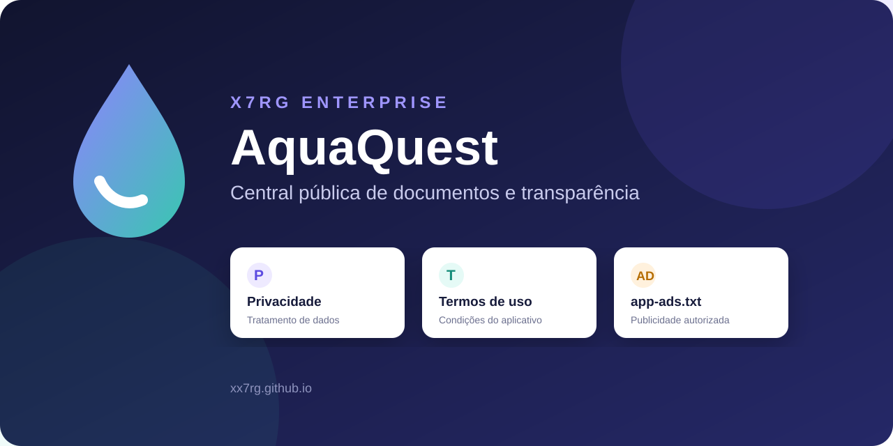
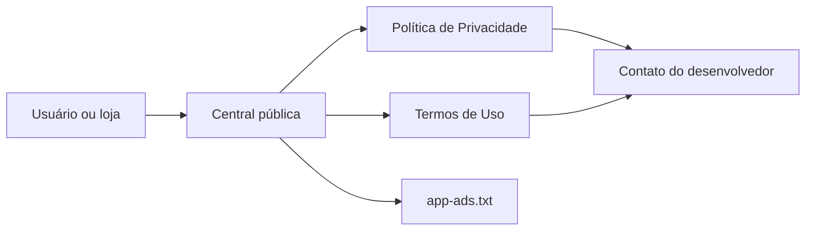

<div align="center">


# AquaQuest — Documentos e Transparência



**Privacidade, condições de uso e informações de publicidade reunidas em um endereço público e acessível.**


[](https://github.com/xx7rg/xx7rg.github.io/actions/workflows/ci.yml)

**[Acessar a central de documentos](https://xx7rg.github.io/)**

Publicado por **x7rG ENTERPRISE™**

</div>

---

## Sobre o projeto

Este repositório publica os documentos do **AquaQuest**, aplicativo que ajuda a criar uma rotina de hidratação por meio de metas, lembretes e evolução de um mascote virtual.

A central oferece um endereço estável para usuários, lojas de aplicativos e serviços de publicidade consultarem como os dados são tratados, quais condições regem o uso do aplicativo e qual conta está autorizada a comercializar seu inventário de anúncios.

O site usa somente HTML e CSS. Não há JavaScript, cookies, analytics, banco de dados ou etapa de compilação.

## Conteúdo publicado

| Documento | Finalidade | Endereço |
| --- | --- | --- |
| Central | Apresenta e organiza todos os documentos. | [Abrir início](https://xx7rg.github.io/) |
| Política de Privacidade | Explica dados locais, permissões, publicidade, retenção e contato. | [Consultar política](https://xx7rg.github.io/privacy-policy.html) |
| Termos de Uso | Define licença, responsabilidades, aviso de saúde e condições de uso. | [Consultar termos](https://xx7rg.github.io/terms-of-use.html) |
| `app-ads.txt` | Declara o vendedor autorizado do inventário publicitário. | [Ver declaração](https://xx7rg.github.io/app-ads.txt) |

## Fluxo de consulta



## Recursos do site

- Layout responsivo para celular e computador.
- Tema automático claro ou escuro conforme o dispositivo.
- Navegação consistente entre a central e os documentos.
- Metadados de descrição, URL canônica e compartilhamento.
- Página `404` para recuperar acessos a endereços inexistentes.
- Acessibilidade com HTML semântico e suporte a movimento reduzido.
- Publicação automática pelo GitHub Pages com HTTPS.

## Estrutura

```text
xx7rg.github.io/
├── index.html             # Central de documentos
├── privacy-policy.html    # Política de Privacidade
├── terms-of-use.html      # Termos de Uso
├── app-ads.txt            # Vendedor autorizado do AdMob
├── 404.html               # Página para endereços inexistentes
├── styles.css             # Identidade visual compartilhada
├── favicon.svg            # Ícone do site
├── docs/images/           # Imagens do README
├── scripts/validate_static.py # Validação dos arquivos e links locais
├── .github/workflows/ci.yml   # Verificação automática no GitHub
└── README.md              # Documentação do repositório
```

## Visualizar localmente

Requer apenas Git e um navegador. Para usar um servidor local, também é necessário Python 3.

```bash
git clone https://github.com/xx7rg/xx7rg.github.io.git
cd xx7rg.github.io
python -m http.server 8000
```

Depois, acesse [localhost:8000](http://localhost:8000).

No macOS/Linux, use `python3` se `python` não estiver disponível.

## Validar os arquivos

Na pasta do projeto, execute:

```bash
python scripts/validate_static.py
```

No macOS/Linux, também pode usar `python3 scripts/validate_static.py`.
O comando verifica as quatro páginas HTML e os destinos locais de links
e imagens, incluindo as referências do README. A CI executa essa conferência
em pushes para `main` e pull requests. Links externos e o conteúdo jurídico
precisam de revisão separada.

## Manutenção e publicação

1. Edite o documento correspondente.
2. Atualize a data no topo quando o conteúdo jurídico mudar.
3. Execute a validação e confira a navegação, os links externos e a apresentação localmente.
4. Envie o commit para a branch `main`.
5. Verifique a publicação em [xx7rg.github.io](https://xx7rg.github.io/).

O GitHub Pages publica a raiz da branch `main`. Preserve os nomes e endereços dos documentos já distribuídos. O arquivo `app-ads.txt` deve permanecer na raiz e seguir o formato exigido pelo serviço de publicidade.

## Contato

Mantido por **x7rG Enterprise — Rogério Gomes dos Santos**.

📧 [contato.rgsantos@gmail.com](mailto:contato.rgsantos@gmail.com)

---

<div align="center">

**© 2026 x7rG ENTERPRISE™** — Todos os direitos reservados.

[](https://www.linkedin.com/in/rgds)
&nbsp;
[](https://www.instagram.com/_7ragnar/)

</div>
